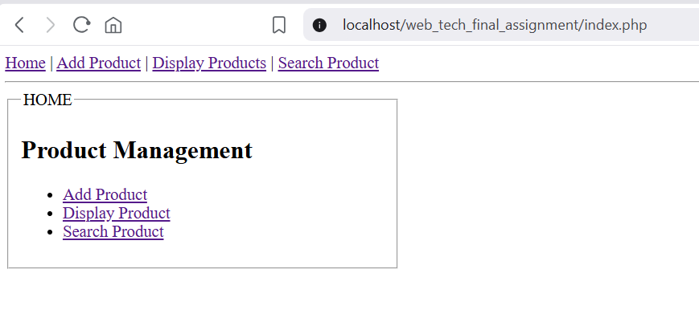
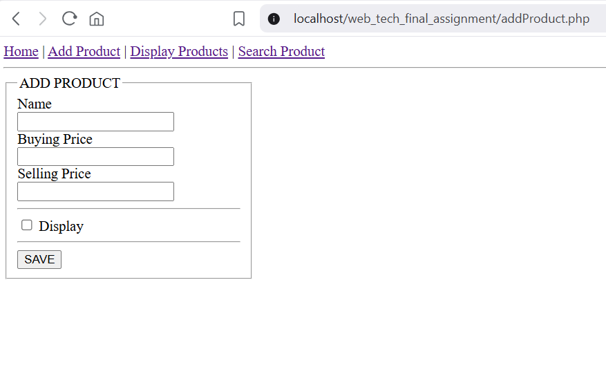
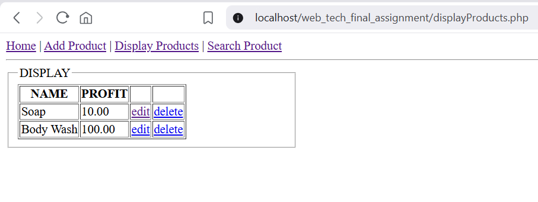
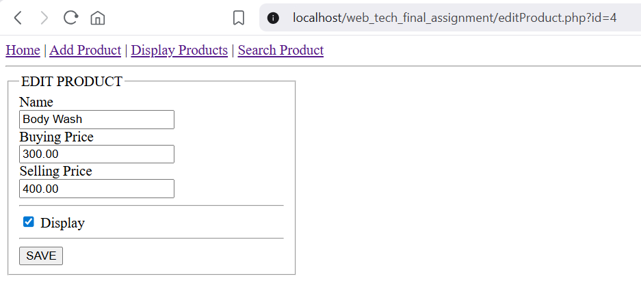
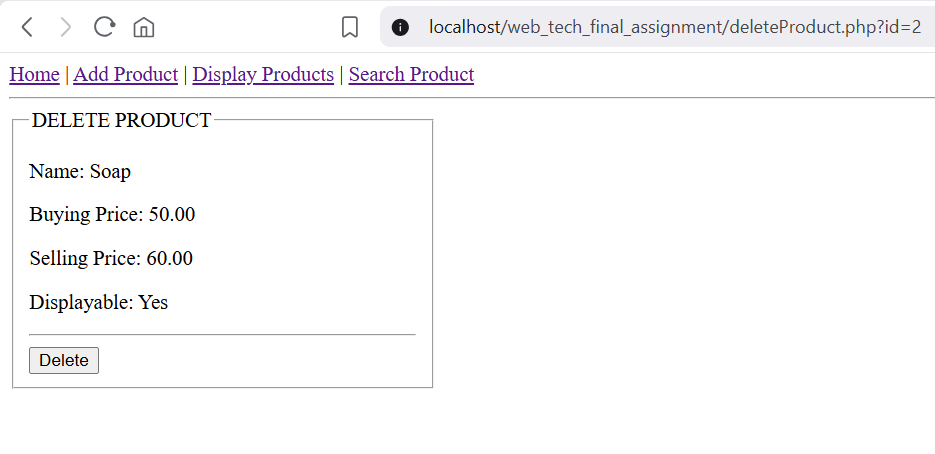
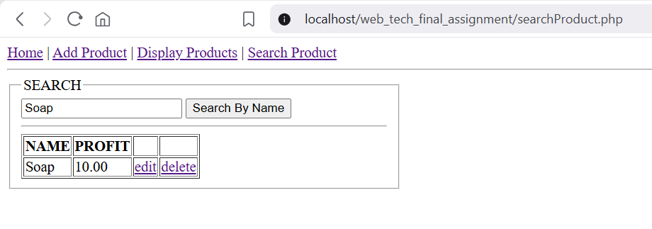

# Assignment Submission: Web Technology Final Assignment

## 1. Student Information

**Student Name:** RAHMAN MD TANVIR
**Student ID:** 23-51455-1
**Course:** Web Technology
**Date:** January 30, 2026
---

## 2. Database Schema

The database `product_db` contains a table named `products` with the following structure:

```sql
CREATE DATABASE product_db;
USE product_db;

CREATE TABLE products (
    id INT AUTO_INCREMENT PRIMARY KEY,
    name VARCHAR(255) NOT NULL,
    buying_price DECIMAL(10, 2) NOT NULL,
    selling_price DECIMAL(10, 2) NOT NULL,
    display VARCHAR(3) DEFAULT 'No'
);
```

---

## 3. Implementation & Screenshots

### Homepage

The system's point of entry with navigation to all required tasks.

**Screenshot:**


---

### Task A: Add Product

Users can add products with Name, Buying Price, Selling Price, and a Display checkbox.

**Screenshot:**


---

### Task B: Display Products

Shows only products where "Display" was checked. Calculates profit dynamically (`Selling Price - Buying Price`).

**Screenshot:**


---

### Task C: Edit Product

Allows users to modify existing product information. The form is pre-filled with the current data from the database.

**Screenshot:**


---

### Task D: Delete Product

A confirmation page showing product details before final deletion.

**Screenshot:**


---

### Task E: Search Product (AJAX)

Real-time search functionality that filters products by name using AJAX without refreshing the page.

**Screenshot:**


---

## 4. File Structure

- `db.php`: Database connection.
- `index.php`: Homepage.
- `nav.php`: Shared navigation bar.
- `addProduct.php`: Add product functionality.
- `displayProducts.php`: Display products list.
- `editProduct.php`: Edit product logic.
- `deleteProduct.php`: Delete product confirmation.
- `searchProduct.php`: UI for search.
- `search_handler.php`: For AJAX search.

---
